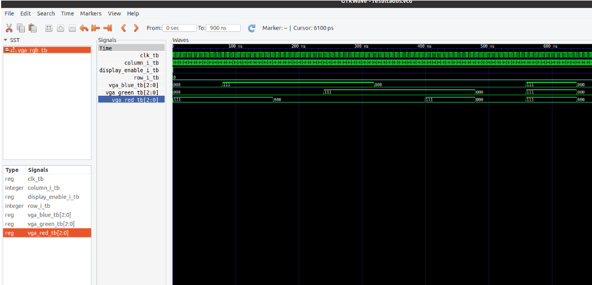

# Controlador VGA

Metodología de trabajo que se utilizó para construir un controlador VGA en una FPGA de XILINX con lenguaje VHDL. 

Este trabajo genera un patrón de video fijo y se realizó en el contexto de la materia de circuitos lógicos programables, carrera de especialización en sistemas embebidos de la UBA, año 2020.

## VGA - Video Graphics Array (VGA)

Se denomina así a una matriz de gráficos de vídeo con las siguientes características

*   Una pantalla estándar analógica de computadora
*   La resolución 640 × 480 píxeles.
*   El conector de 15 contactos D subminiatura.
*   La tarjeta gráfica que comercializó IBM 1988.

A partir del VGA, se amplía por otras organizaciones y fabricantes, siguiendo el mismo principio. De esta manera el trabajo sirve para generar otras resoluciones de video como por ejemplo 800x600 (SVGA).

### Señales de sincronismo

En la siguiente imagen se puede ver la relación que hay entre las señales de sincronismo vertical y horizontal. La zona activa es la información que se visualiza en pantalla y las zonas grises corresponde a la información utilizada para sincronizar la imágen. 

El sincronismo horizontal está relacionado con la posición en pantalla de las señales de video. Cuando se terminan de mostrar todos los píxeles correspondientes a una fila aparecen 3 tiempos importantes. Primero el Front porch, luego un estado bajo denominado pulso de sincronismo y un último tiempo en alto denominado back porch. En este momento se muestra la información correspondiente a la siguiente fila.

Cuando se completan todas las filas, se produce de manera similar al horizontal, el pulso de sincronismo vertical. Éste marca la frecuencia de muestreo de la pantalla.

### VGA timing

En la siguiente imágen extraída de la página [http://tinyvga.com/vga-timing](http://tinyvga.com/vga-timing) se pueden ver los tiempos que deben cumplirse para las diferentes resoluciones de video. \
En particular se utilizó la de la siguiente opción.

Para la implementación en circuito digital se utilizó la información del siguiente cuadro. Se puede ver que las magnitudes correspondientes a la señal horizontal están expresados en pulsos de reloj o también llamado “píxel clock” y, las correspondientes a la vertical en “líneas”.

### Señales de video

Si bien se generan 3 bits para cada señal de video, en las pruebas se utilizó un 1 bits para cada color. En la siguiente imágen se pueden ver los posibles colores que se pueden formar con esta información.

## Descripción del hardware

Se pueden encontrar las siguientes entidades. VGA_Sync es la que genera los pulsos de sincronismo en base a la señal de reloj. La entidad VGA_Sync_MMCM agrega a la anterior un MMCM de la herramienta vivado, para poder escalar el reloj de la placa (125 MHz) a la de pixel que necesitamos (25.175 MHz). La entidad VGA_RGB es la que genera las señales de video. 

Es importante destacar que en la zona fuera de pantalla, estas señales deben ser nulas para no producir ruido o sincronizaciones incorrectas. \
Por último, una entidad VGA_background que corresponde a nuestro circuito completo, es decir al “top level”.

A continuación se puede observar el esquemático del RTL (register transfer level)

### Reporte de utilización de la herramienta Vivado - Placa ARTY Z-20

### Simulación

Si bien la síntesis se realizó en la herramienta VIVADO, la mayor parte se pudo desarrollar en el editor de texto VISUAL CODE STUDIO, analizando y compilando con  GHDL y GTKWAVE para la visualización de los testbench.

En las siguientes imágenes se pueden observar capturas de los comandos para compilar una entidad con su testbench, elaborar y correr la simulación, como así también capturas de GTKWAVE.

#

#

#

A continuación se muestra una simulación en vivado del bloque final.

## Opciones para utilizar varios bits de video

A continuación se muestran dos ejemplos de cómo proseguir para una señal de video más detallada.

Imágen extraída de [https://www.researchgate.net/publication/312984160_FPGA_Based_Real_Time_Iris_Recognition_Signature](https://www.researchgate.net/publication/312984160_FPGA_Based_Real_Time_Iris_Recognition_Signature)

Imágen extraída del datasheet [https://www.analog.com/media/en/technical-documentation/data-sheets/ADV7123.pdf](https://www.analog.com/media/en/technical-documentation/data-sheets/ADV7123.pdf)